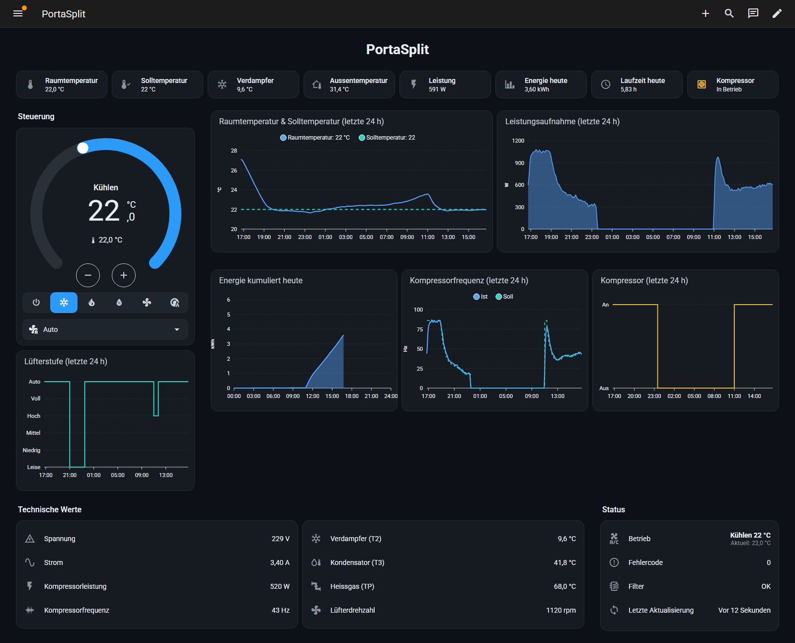

# Home Assistant dashboard for the Midea PortaSplit

A dark Home Assistant dashboard for the Midea PortaSplit air conditioner, built on the entities of the community integration [Midea AC LAN](https://github.com/wuwentao/midea_ac_lan). It shows temperatures, power, energy, compressor and fan data with 24-hour history charts.



*The screenshot uses simulated values for a hot summer day. The layout, cards and entities match the live dashboard.*

Step-by-step guide (German): [Midea PortaSplit mit Home Assistant lokal steuern und sicher betreiben](https://rafaelpfister.ch/blog/midea-portasplit-home-assistant)

## Contents

| File | Purpose |
|---|---|
| `dashboard.yaml` | Dashboard for the raw configuration editor (sections view, 4 columns) |
| `packages/portasplit.yaml` | Helper sensors: compressor running, fan level as number, runtime today, energy today |
| `themes/portasplit.yaml` | Dark theme `PortaSplit Dark` |

## Requirements

- Home Assistant 2024.10 or newer (sections view, heading card); tested with 2026.7
- [Midea AC LAN](https://github.com/wuwentao/midea_ac_lan), tested with v2026.9.2
- [apexcharts-card](https://github.com/RomRider/apexcharts-card) (HACS, frontend)
- `packages` and `themes` enabled in `configuration.yaml`:

```yaml
homeassistant:
  packages: !include_dir_named packages

frontend:
  themes: !include_dir_merge_named themes
```

## Installation

1. Add the PortaSplit with Midea AC LAN and note its device ID from the entity IDs, for example `climate.123456789012345_climate`.
2. Midea AC LAN creates only the climate entity by default. Open *Settings > Devices & services > Midea AC LAN > Configure* and select the sensors listed below.
3. Replace every `DEVICE_ID` in `packages/portasplit.yaml` and `dashboard.yaml` with your device ID.
4. Copy `packages/portasplit.yaml` to `/config/packages/` and `themes/portasplit.yaml` to `/config/themes/`, then restart Home Assistant (the `utility_meter` needs a restart).
5. *Settings > Dashboards > Add dashboard > New dashboard from scratch*, open it, *Edit > ⋮ > Raw configuration editor*, replace the content with `dashboard.yaml` and save.

## Entities used

Reported by a PortaSplit (device type `0xAC`) with Midea AC LAN v2026.9.2:

| Entity | Example |
|---|---|
| `climate.DEVICE_ID_climate` | modes off, auto, cool, dry, heat, fan_only; fan silent to full and auto |
| `sensor.DEVICE_ID_indoor_temperature` | 23.0 °C |
| `sensor.DEVICE_ID_outdoor_temperature` | 23.5 °C |
| `sensor.DEVICE_ID_realtime_power` | 1.5 W (standby) |
| `sensor.DEVICE_ID_total_energy_consumption` | 90.54 kWh |
| `sensor.DEVICE_ID_compressor_frequency` / `_target_compressor_frequency` | Hz (0 when idle) |
| `sensor.DEVICE_ID_compressor_voltage` / `_current` / `_power` | 230 V, 1 A, 4 W |
| `sensor.DEVICE_ID_indoor_coil_temperature` (T2) / `_outdoor_coil_temperature` (T3) / `_discharge_pipe_temperature` (TP) | °C |
| `sensor.DEVICE_ID_indoor_fan_speed` | rpm |
| `sensor.DEVICE_ID_error_code`, `binary_sensor.DEVICE_ID_full_dust` | 0, filter status |

The PortaSplit has no humidity sensor: `indoor_humidity` stays `unknown`, so the dashboard does not use it.

## Helper sensors

| Entity | Source |
|---|---|
| `binary_sensor.portasplit_kompressor` | compressor frequency above 0 Hz (fallback: power above 150 W) |
| `sensor.portasplit_lufterstufe` | fan mode as number 1 to 6 for the step chart |
| `sensor.portasplit_laufzeit_heute` | `history_stats`, compressor runtime since midnight |
| `sensor.portasplit_energie_heute` | `utility_meter`, daily cycle on the total energy counter |
| `sensor.portasplit_letzte_meldung` | timestamp of the last report from the device |

## License

MIT
